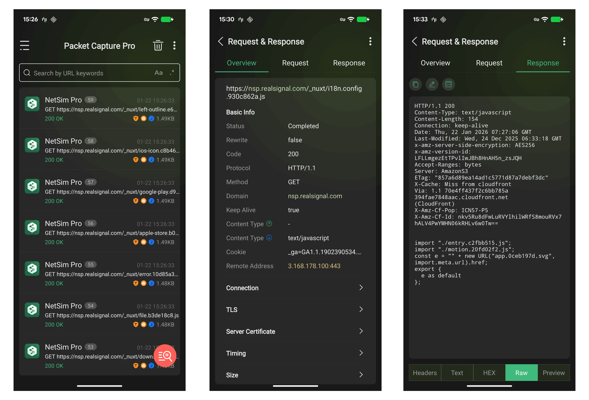

# Packet Capture Pro

[中文版本](README_CN.md)

⚠️ **Note: Packet Capture Pro is a closed-source project. This repository is only used for managing requirements and user feedback.**

[Packet Capture Pro](https://pcp.realsignal.com/) is a next-generation advanced cross-platform packet capture tool. Packet Capture Pro features cross-platform support, no Root required, lightweight, high performance, and real-time synchronization, with the philosophy of making network debugging faster and simpler, helping developers and technical personnel improve productivity! Now supports Android, iOS, Windows, and macOS platforms.

Official Website: https://pcp.realsignal.com/

  

## What is Packet Capture Pro?

**Packet Capture Pro = Professional Packet Capture + Full-Chain Visibility + Cross-Platform Collaboration**

Packet Capture Pro is a network debugging and development tool designed specifically for developers and technical personnel, implementing secure packet capture based on advanced virtual machine technology. Compared to traditional packet capture tools, Packet Capture Pro requires no Root/Jailbreak permissions, supports real-time data mirroring from mobile devices to PCs, achieving multi-platform collaborative debugging with one tool.

### Core Advantages

#### 🔒 Secure and Convenient
- **No Root Required**: Android-based secure packet capture technology using virtual machines
- **iOS No Jailbreak**: Works without jailbreaking the device
- **HTTPS Decryption**: Supports HTTPS traffic decryption and analysis
- **Privacy Protection**: All data is stored only on your device and never uploaded to any server

#### 🌐 Full Platform Support
- **Android**: Supports the latest Android systems
- **iOS**: Compatible with iPhone and iPad
- **Windows & macOS**: Desktop collaboration and debugging
- **Cross-Platform Sync**: Each account can have 1 device online simultaneously on different platforms

#### ⚡ Powerful Features
- **Real-Time Data Mirroring**: Mobile data projected to PC in real-time
- **Multi-Device Collaboration**: Supports simultaneous projection from multiple devices
- **Smart Rewrite and Replay**: Flexible packet rewriting and precise replay
- **Full-Chain Visibility**: Visual debugging, security detection, third-party protocol analysis

## Features

### 1. Traffic Analysis

#### Android
- [x] HTTP/HTTPS/WebSocket packet capture support
- [x] Multiple format packet data parsing and display
- [x] TLSv1.1, TLSv1.2 encryption protocol support
- [x] Request/Response comparison
- [x] Request rewrite and replay functionality
- [x] Real-time projection to PC client
- [x] Virtual machine-based secure packet capture
- [x] Dark/Light theme switching
- [x] Multi-type quick search
- [x] Data import & export
- [x] Toolbox (encryption/decryption, certificate hash, regex)

#### iOS
- [x] HTTP/HTTPS/WebSocket packet capture support
- [x] Multiple format packet data parsing and display
- [x] TLSv1.1, TLSv1.2, TLSv1.3 encryption protocol support
- [x] Request/Response comparison
- [x] Request rewrite and replay functionality
- [x] No jailbreak required
- [x] Real-time projection to PC client
- [x] Dark/Light theme switching
- [x] Multi-type quick search
- [x] Data import & export
- [x] Toolbox (encryption/decryption, regex)

#### Windows & macOS
- [x] HTTP/HTTPS packet capture support
- [x] Multiple format packet data parsing and display
- [x] Request/Response comparison
- [x] Request replay functionality
- [x] Mobile-to-PC data mirroring
- [x] Multi-type quick search
- [x] Data import & export

### Screenshots

  

### 2. Debugging Features

#### Full-Chain Visibility
✅ **Visual Debugging · Security Detection · Third-Party Protocols**
- View API request/response content in real-time, locate timeouts, data errors, and other issues
- Verify frontend data format correctness and check backend data integrity
- Analyze plaintext transmission of sensitive information (passwords, tokens), discover unencrypted communication risks
- Support multiple format packet data parsing and display
- Multi-type quick search

#### Packet Rewrite and Replay
✅ **Comprehensive Debugging Tools**
- Quickly construct complex test scenarios like server errors (500)
- Reproduce sporadic user-side issues based on real traffic, eliminating the "cannot reproduce in dev environment" blind spot

#### Cross-Platform Data Mirroring
✅ **Focus on visualizing mobile data on PC**
- Break through mobile screen limitations, view, search, and filter app network requests on PC in real-time
- Support simultaneous projection from multiple devices
- Help developers/operations personnel efficiently complete network debugging and data analysis

### 3. User Experience

- [x] **Dark/Light Theme Switching**: Minimalist and deep, switch styles instantly
- [x] **Multiple Format Support**: Smart parsing of JSON, XML, HTML, images, and more
- [x] **Quick Search**: Multi-dimensional search by URL, method, status code, content, etc.
- [x] **Data Persistence**: Support packet data import/export for easy data sharing and retrospection

## Download and Installation

The Packet Capture Pro official website provides the latest version downloads: [Click here](https://pcp.realsignal.com/)

### Android Installation

You can get the app for free from Google Play.

### iOS Installation

You can get the app for free from the App Store.

### Windows Installation

Download from the official website: [Click here](https://pcp.realsignal.com/)

On Windows, you will download `Setup.exe`, just follow the Setup installer instructions.

### macOS Installation

Download from the official website: [Click here](https://pcp.realsignal.com/)

On macOS devices, Open the DMG file and drag it into the `Applications` folder.

## Mobile Support

Packet Capture Pro mobile app supports standalone use as well as collaboration with the desktop app.

- **Standalone Use**: Can perform traffic analysis and network debugging independently without relying on the desktop app
- **Collaboration Mode**: Mobile app can project traffic data to the desktop in real-time for more efficient analysis and debugging on a PC screen

You can get the app for free from Play Store and App Store.

&nbsp;&nbsp;

### Screenshots

  

## Use Cases

### Development and Debugging
- API interface debugging and testing
- Locate network request timeout issues
- Verify data format and integrity
- Reproduce production environment network issues

### Security Detection
- Detect plaintext transmission of sensitive information
- Analyze application network security risks
- Verify encrypted communication implementation
- Third-party SDK traffic analysis

### Performance Optimization
- Analyze network request latency
- Optimize API call strategies
- Detect duplicate requests
- Reduce unnecessary network overhead

## Privacy and Security Policy

- Packet Capture Pro is designed for developers and technical personnel to support network debugging and development work
- To ensure legal and compliant use, it is strictly prohibited to use this tool for any illegal purposes. Any consequences arising from illegal use shall be borne by the user and have nothing to do with the company
- **We do not collect, store, or share any user packet capture data. All data is stored only on your device and is never uploaded to any server**

## User Manual

For detailed usage instructions and tutorials, please visit our official documentation:

**📖 [User Manual](https://pcp.realsignal.com/tutorials/manual)**

The user manual includes:
- 📱 **Android** - Complete guide for Android devices
- 🍎 **iOS** - Step-by-step instructions for iPhone and iPad
- 💻 **Windows** - Desktop client usage guide
- 🖥️ **macOS** - Mac application tutorial
- 🔧 **Emulator** - Emulator configuration and setup

## Feedback

If you encounter problems during use or have feature suggestions, please feel free to provide feedback through the following methods:

- [Submit Bug Report](https://github.com/REALSIGNAL/packetcapturepro-app/issues/new?template=bug_report.yml)
- [Submit Feature Request](https://github.com/REALSIGNAL/packetcapturepro-app/issues/new?template=feature_request.yml)
- [Ask Usage Questions](https://github.com/REALSIGNAL/packetcapturepro-app/issues/new?template=question.yml)

## Contact Us

- Official Website: https://pcp.realsignal.com/
- More Network Tools: [NetSim Pro](https://nsp.realsignal.com/)

---

**Realsignal Pte. Ltd. © 2026 All rights reserved**
